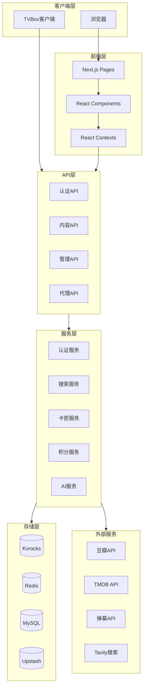
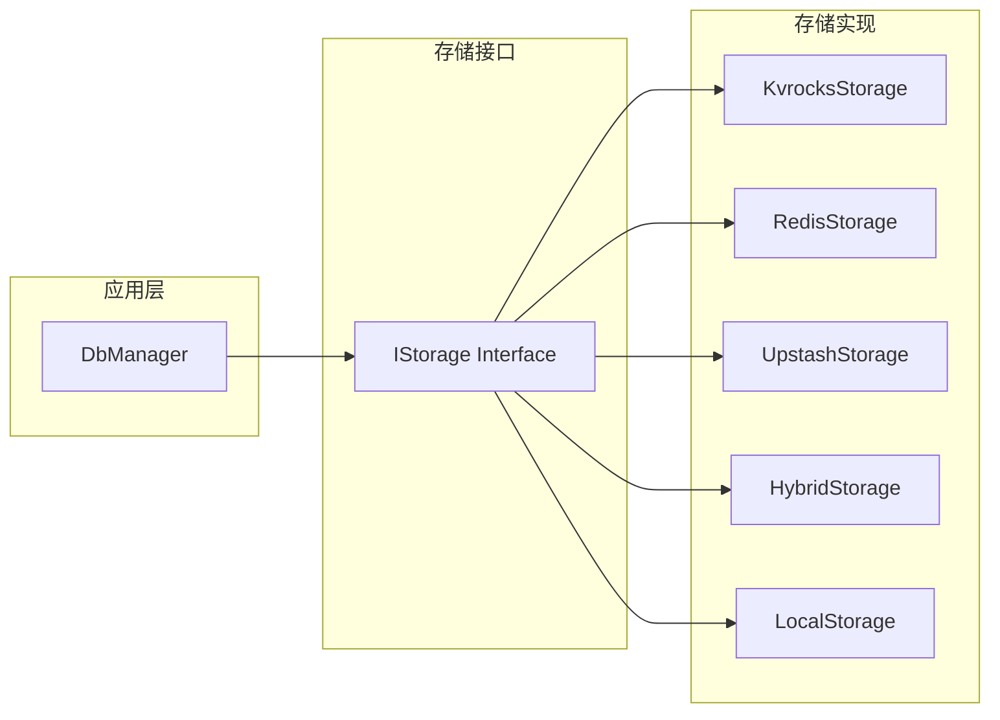
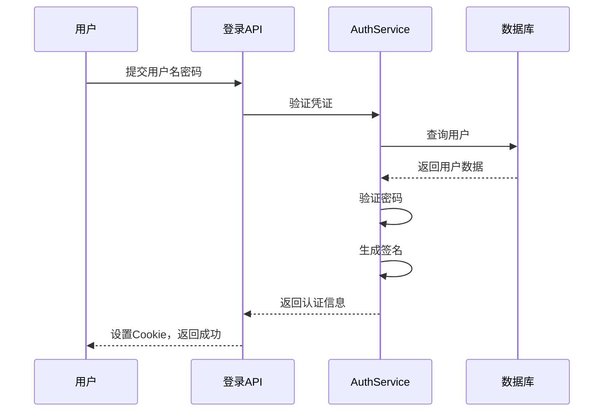
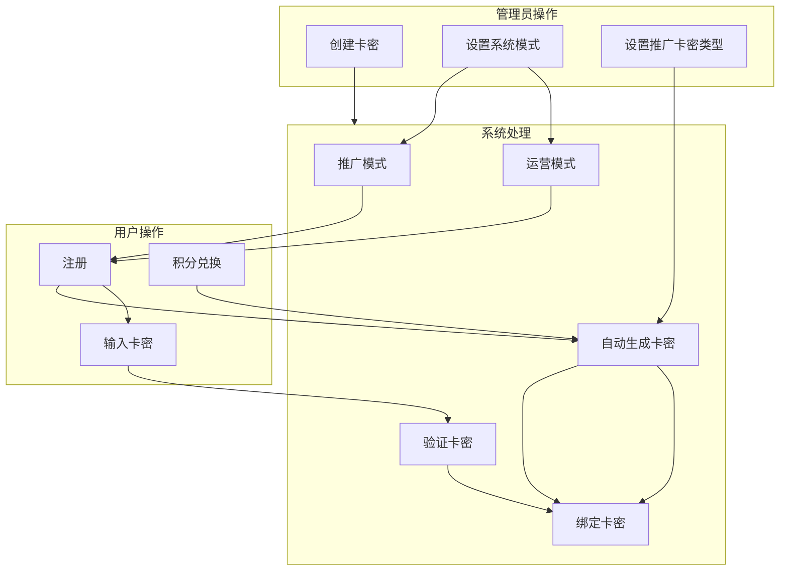
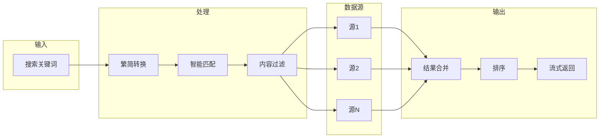
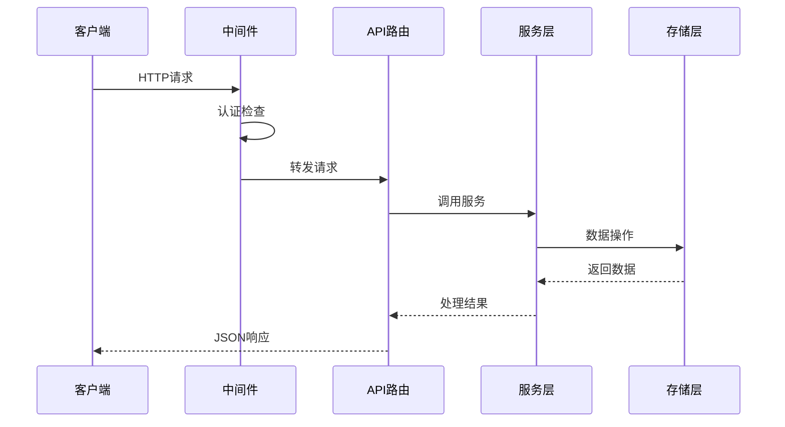
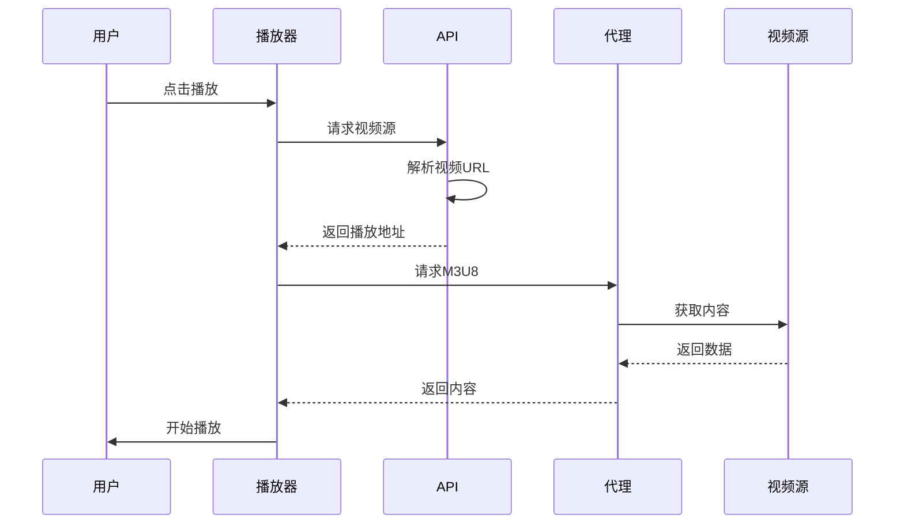
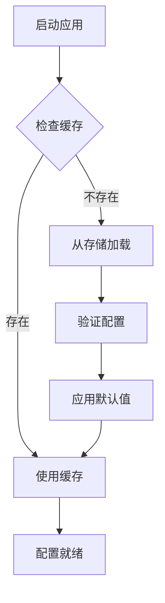
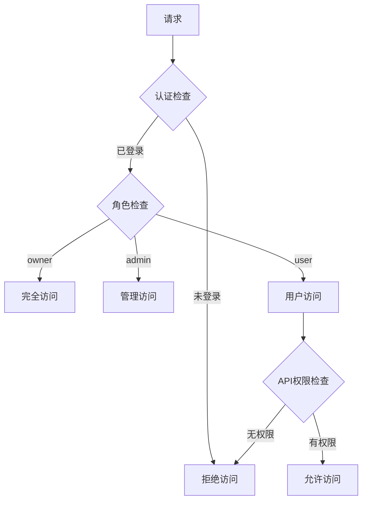

# LunaTV 系统架构文档

> **版本**: v6.1.1  
> **更新日期**: 2026-02-18

---

## 1. 系统架构概述

LunaTV 采用 Next.js App Router 架构，是一个前后端一体的全栈应用。系统设计遵循模块化原则，支持多种存储后端，具有高度的可扩展性。

### 1.1 架构图



### 1.2 技术选型理由

| 技术           | 选型理由                                   |
| -------------- | ------------------------------------------ |
| Next.js 16     | App Router架构，支持SSR和API路由，性能优秀 |
| React 19       | 最新版本，支持服务端组件和并发特性         |
| TypeScript     | 类型安全，提高代码质量和开发效率           |
| Tailwind CSS   | 原子化CSS，开发效率高，体积小              |
| ArtPlayer      | 功能强大的播放器，支持多种格式和插件       |
| TanStack Query | 强大的数据请求和缓存管理                   |

---

## 2. 目录结构详解

```
/workspace/
├── src/
│   ├── app/                          # Next.js App Router
│   │   ├── api/                      # API路由
│   │   │   ├── admin/                # 管理后台API
│   │   │   │   ├── cardkey/          # 卡密管理API
│   │   │   │   ├── config/           # 配置管理API
│   │   │   │   ├── user/             # 用户管理API
│   │   │   │   ├── source/           # 资源源管理API
│   │   │   │   └── ...               # 其他管理API
│   │   │   ├── auth/                 # 认证API
│   │   │   │   └── oidc/             # OIDC认证
│   │   │   ├── douban/               # 豆瓣API
│   │   │   ├── proxy/                # 代理API
│   │   │   │   ├── m3u8/             # M3U8代理
│   │   │   │   ├── stream/           # 流代理
│   │   │   │   └── segment/          # 分片代理
│   │   │   ├── tvbox/                # TVBox API
│   │   │   ├── register/             # 注册API
│   │   │   ├── login/                # 登录API
│   │   │   └── ...                   # 其他API
│   │   ├── admin/                    # 管理后台页面
│   │   ├── play/                     # 播放页面
│   │   ├── douban/                   # 豆瓣浏览页面
│   │   ├── release-calendar/         # 发布日历页面
│   │   ├── register/                 # 注册页面
│   │   ├── login/                    # 登录页面
│   │   ├── layout.tsx                # 根布局
│   │   └── page.tsx                  # 首页
│   │
│   ├── components/                   # React组件
│   │   ├── play/                     # 播放器相关
│   │   │   ├── VideoPlayer.tsx       # 视频播放器
│   │   │   ├── DanmuSettingsPanel.tsx# 弹幕设置
│   │   │   ├── DownloadButtons.tsx   # 下载按钮
│   │   │   └── ...
│   │   ├── watch-room/               # 观影房
│   │   ├── CardKeyManager.tsx        # 卡密管理
│   │   ├── InvitationConfig.tsx      # 邀请配置
│   │   ├── UserReferralInfo.tsx      # 用户邀请信息
│   │   └── ...
│   │
│   ├── lib/                          # 核心库
│   │   ├── db.ts                     # 数据库管理器
│   │   ├── config.ts                 # 配置管理
│   │   ├── auth.ts                   # 认证逻辑
│   │   ├── cardkey.ts                # 卡密服务
│   │   ├── invitation-points.ts      # 积分邀请服务
│   │   ├── downstream.ts             # 下游搜索
│   │   ├── douban.ts                 # 豆瓣爬虫
│   │   ├── tmdb.client.ts            # TMDB客户端
│   │   ├── live.ts                   # 直播功能
│   │   ├── ai-orchestrator.ts        # AI编排器
│   │   ├── video-cache.ts            # 视频缓存
│   │   └── ...
│   │
│   ├── contexts/                     # React Context
│   │   ├── DownloadContext.tsx       # 下载上下文
│   │   └── GlobalCacheContext.tsx    # 全局缓存上下文
│   │
│   └── types.ts                      # 类型定义
│
├── public/                           # 静态资源
├── scripts/                          # 脚本文件
├── .husky/                           # Git Hooks
├── next.config.js                    # Next.js配置
├── tailwind.config.js                # Tailwind配置
├── tsconfig.json                     # TypeScript配置
└── package.json                      # 项目配置
```

---

## 3. 核心模块架构

### 3.1 数据存储架构



#### IStorage 接口定义

```typescript
interface IStorage {
  // 播放记录
  getPlayRecord(userName: string, key: string): Promise<PlayRecord | null>;
  setPlayRecord(
    userName: string,
    key: string,
    record: PlayRecord,
  ): Promise<void>;
  getAllPlayRecords(userName: string): Promise<{ [key: string]: PlayRecord }>;
  deletePlayRecord(userName: string, key: string): Promise<void>;

  // 收藏
  getFavorite(userName: string, key: string): Promise<Favorite | null>;
  setFavorite(userName: string, key: string, favorite: Favorite): Promise<void>;
  getAllFavorites(userName: string): Promise<{ [key: string]: Favorite }>;
  deleteFavorite(userName: string, key: string): Promise<void>;

  // 用户管理
  registerUser(userName: string, password: string): Promise<void>;
  verifyUser(userName: string, password: string): Promise<boolean>;
  checkUserExist(userName: string): Promise<boolean>;
  changePassword(userName: string, newPassword: string): Promise<void>;
  deleteUser(userName: string): Promise<void>;

  // 管理配置
  getAdminConfig(): Promise<AdminConfig | null>;
  setAdminConfig(config: AdminConfig): Promise<void>;
}
```

### 3.2 认证架构



### 3.3 卡密系统架构



### 3.4 搜索架构



---

## 4. 数据流架构

### 4.1 请求处理流程



### 4.2 视频播放流程



---

## 5. 配置系统

### 5.1 配置结构

```typescript
interface AdminConfig {
  ConfigSubscribtion: {
    URL: string;
    AutoUpdate: boolean;
    LastCheck: string;
  };
  SiteConfig: {
    SiteName: string;
    Announcement: string;
    SearchDownstreamMaxPage: number;
    DefaultUserTags?: string[];
  };
  UserConfig: {
    AllowRegister?: boolean;
    Users: User[];
    Tags?: Tag[];
  };
  SourceConfig: Source[];
  CardKeyConfig?: {
    enabled: boolean;
    requireCardKeyOnRegister: boolean;
    systemMode?: 'promotion' | 'operation';
    promotionCardKeyType?: 'year' | 'quarter' | 'month' | 'week';
  };
  InvitationConfig?: {
    enabled: boolean;
    rewardPoints: number;
    redeemThreshold: number;
    cardKeyType: 'year' | 'quarter' | 'month' | 'week';
  };
  // ... 其他配置
}
```

### 5.2 配置加载流程



---

## 6. 安全架构

### 6.1 认证安全

- **密码哈希**: 使用SHA-256签名验证
- **防重放攻击**: 时间戳验证
- **Cookie安全**: HttpOnly, Secure配置
- **会话管理**: 7天过期时间

### 6.2 权限控制



### 6.3 内容安全

- **成人内容过滤**: 双层过滤机制
- **关键词过滤**: 可配置过滤词
- **来源标记**: 成人内容源标记

---

## 7. 性能优化

### 7.1 缓存策略

| 缓存层   | 技术          | 用途       |
| -------- | ------------- | ---------- |
| 应用缓存 | 内存          | 热点数据   |
| 数据缓存 | Redis/Kvrocks | 持久化缓存 |
| HTTP缓存 | 浏览器        | 静态资源   |

### 7.2 查询优化

- **批量查询**: 减少数据库往返
- **索引优化**: MySQL索引配置
- **连接池**: 数据库连接复用

### 7.3 前端优化

- **虚拟滚动**: react-window处理大列表
- **代码分割**: Next.js自动分割
- **图片懒加载**: 按需加载图片

---

## 8. 扩展机制

### 8.1 添加新的存储后端

1. 实现 `IStorage` 接口
2. 在 `db.ts` 中注册新存储类型
3. 配置环境变量

### 8.2 添加新的API

1. 在 `src/app/api/` 创建路由文件
2. 实现 GET/POST/PUT/DELETE 方法
3. 添加认证和权限检查

### 8.3 添加新的组件

1. 在 `src/components/` 创建组件文件
2. 使用 TypeScript 定义 props
3. 遵循项目代码规范
