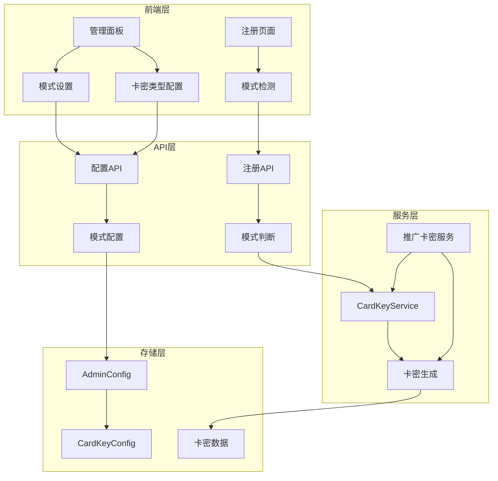
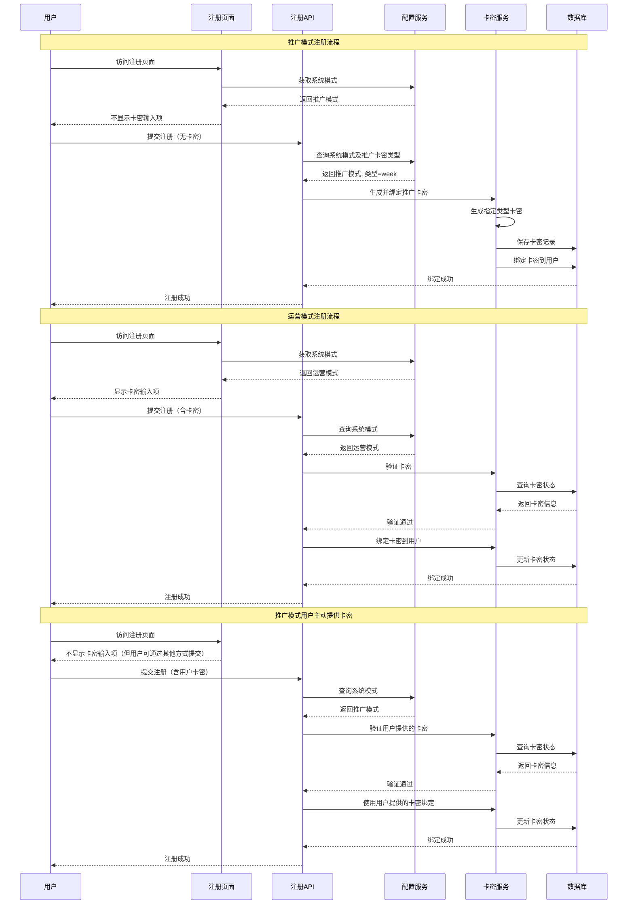

# 推广模式与运营模式技术设计文档

Feature Name: promotion-operation-mode
Updated: 2026-02-18

## Description

本功能实现系统运行模式的切换机制，支持推广模式和运营模式两种状态。推广模式下，新用户注册时系统自动生成并绑定一张指定类型（管理员可配置：1周/1月/1季/1年）的卡密，简化注册流程；运营模式下保持现有注册机制，用户需手动输入卡密。该功能涉及配置存储、注册API改造、前端注册页面适配和管理面板设置界面四个核心部分。

## Architecture

### 系统架构图



### 数据流图



## Components and Interfaces

### 1. 数据类型定义

#### 1.1 扩展卡密配置类型

```typescript
// 扩展现有的 CardKeyConfig
interface CardKeyConfig {
  enabled: boolean; // 是否启用卡密系统（默认 false）
  requireCardKeyOnRegister: boolean; // 注册时是否必须绑定卡密（默认 true）
  // 新增字段
  systemMode: 'promotion' | 'operation'; // 系统运行模式（默认 operation）
  promotionCardKeyType: 'year' | 'quarter' | 'month' | 'week'; // 推广模式自动绑定的卡密类型（默认 week）
}
```

#### 1.2 卡密来源类型扩展

```typescript
// 扩展卡密来源类型
type CardKeySource = 'admin_created' | 'promotion_register' | 'points_redeem';

// 扩展 CardKey 数据结构
interface CardKey {
  key: string; // 卡密密钥（明文，仅创建时返回）
  keyHash: string; // 卡密哈希值
  keyType: 'year' | 'quarter' | 'month' | 'week'; // 卡密类型
  status: 'unused' | 'used' | 'expired'; // 卡密状态
  createdAt: number; // 创建时间戳
  expiresAt: number; // 过期时间戳
  boundTo?: string; // 绑定的用户名
  boundAt?: number; // 绑定时间戳
  source?: CardKeySource; // 卡密来源（新增）
}
```

#### 1.3 模式设置请求/响应

```typescript
interface SystemModeSettingRequest {
  mode: 'promotion' | 'operation';
  promotionCardKeyType?: 'year' | 'quarter' | 'month' | 'week';
}

interface SystemModeSettingResponse {
  success: boolean;
  currentMode: 'promotion' | 'operation';
  promotionCardKeyType: 'year' | 'quarter' | 'month' | 'week';
  message?: string;
}

interface RegisterConfigResponse {
  allowRegister: boolean;
  systemMode: 'promotion' | 'operation';
  showCardKeyInput: boolean; // 是否显示卡密输入项
}
```

### 2. 卡密服务扩展接口

```typescript
interface ICardKeyServiceExtension {
  // 生成推广卡密并绑定到用户
  generateAndBindPromotionCardKey(
    username: string,
    cardKeyType: 'year' | 'quarter' | 'month' | 'week',
  ): Promise<{
    success: boolean;
    cardKey?: CardKey;
    error?: string;
  }>;

  // 获取推广模式统计
  getPromotionStats(): Promise<{
    totalPromotionCardKeys: number; // 推广模式生成的卡密总数
    activePromotionCardKeys: number; // 有效的推广卡密数
  }>;
}
```

### 3. API 端点

#### 3.1 新增 API 端点

```
POST /api/admin/cardkey/system-mode    - 设置系统模式和推广卡密类型
GET  /api/register/config              - 获取注册配置（包含模式信息）
GET  /api/user/cardkey/info            - 获取用户卡密信息（用于欢迎栏）
GET  /api/user/welcome-banner          - 获取欢迎栏显示信息
```

#### 3.2 修改现有 API

```
POST /api/register                      - 根据模式适配注册逻辑
```

### 4. 配置存储扩展

```typescript
// 在 AdminConfig 中扩展 CardKeyConfig
// 修改 src/lib/admin.types.ts

interface AdminConfig {
  // ... 现有字段
  CardKeyConfig?: {
    enabled: boolean;
    requireCardKeyOnRegister: boolean;
    // 新增字段
    systemMode?: 'promotion' | 'operation'; // 默认 'operation'
    promotionCardKeyType?: 'year' | 'quarter' | 'month' | 'week'; // 默认 'week'
  };
}
```

### 5. 欢迎栏到期信息展示接口

```typescript
// 用户卡密到期信息
interface UserCardKeyInfo {
  username: string;
  hasCardKey: boolean; // 是否有绑定的卡密
  isPromotionUser: boolean; // 是否为推广模式用户
  expirationDate?: number; // 到期时间戳
  isExpiringSoon: boolean; // 是否即将到期（7天内）
  daysUntilExpiration?: number; // 剩余天数
  canInviteForExtension: boolean; // 是否可以通过邀请延期
}

// 欢迎栏信息响应
interface WelcomeBannerInfo {
  type: 'promotion_expiring' | 'normal_expiration' | 'no_cardkey' | 'admin';
  message: string; // 显示的消息
  expirationDate?: string; // 格式化的到期日期 YYYY-MM-DD
  actionText?: string; // 可操作按钮文本
  actionUrl?: string; // 可操作按钮跳转链接
  urgency: 'low' | 'medium' | 'high'; // 紧急程度
}
```

## Data Models

### 1. 配置数据结构

```json
{
  "CardKeyConfig": {
    "enabled": true,
    "requireCardKeyOnRegister": true,
    "systemMode": "promotion",
    "promotionCardKeyType": "week"
  }
}
```

### 2. 卡密数据结构扩展

```json
{
  "key": "ABC123XYZ789",
  "keyHash": "a1b2c3d4...",
  "keyType": "week",
  "status": "used",
  "createdAt": 1706745600000,
  "expiresAt": 1707350400000,
  "boundTo": "testuser",
  "boundAt": 1706832000000,
  "source": "promotion_register"
}
```

## Correctness Properties

### 1. 不变性约束

1. **模式默认值**: 系统模式默认为 `operation`，确保向后兼容
2. **推广卡密类型默认值**: 推广卡密类型默认为 `week`
3. **卡密来源标识**: 推广模式自动生成的卡密必须标记 `source` 为 `promotion_register`
4. **用户卡密优先**: 推广模式下用户主动提供的卡密优先使用
5. **到期信息准确性**: 欢迎栏显示的到期信息必须与用户实际绑定的卡密一致

### 2. 业务规则约束

1. **模式切换权限**: 只有 owner 和 admin 角色可以修改系统模式
2. **手动卡密优先**: 推广模式下，如果用户提供了卡密，优先使用用户提供的卡密
3. **配置一致性**: 前端注册页面与后端注册API必须使用同一模式配置
4. **推广用户识别**: 卡密来源为 `promotion_register` 的用户被识别为推广用户
5. **到期提醒优先级**: 卡密即将到期（7天内）时，优先显示到期提醒
6. **管理员豁免**: owner 和 admin 角色的用户不显示卡密到期信息

## Error Handling

### 1. 错误码定义

| 错误码                    | 错误信息     | HTTP 状态码 | 说明                 |
| ------------------------- | ------------ | ----------- | -------------------- |
| SYSTEM_MODE_INVALID       | 系统模式无效 | 400         | 提供的模式值不合法   |
| CARDKEY_TYPE_INVALID      | 卡密类型无效 | 400         | 提供的卡密类型不合法 |
| PERMISSION_DENIED         | 权限不足     | 403         | 非管理员尝试修改模式 |
| CONFIG_UPDATE_FAILED      | 配置更新失败 | 500         | 配置保存失败         |
| CARDKEY_GENERATION_FAILED | 卡密生成失败 | 500         | 推广卡密生成失败     |

### 2. 错误处理策略

1. **推广模式下卡密生成失败**:
   - 返回 500 错误
   - 记录详细错误日志
   - 提示用户稍后重试

2. **模式切换失败**:
   - 返回 500 错误
   - 记录详细错误日志
   - 保持原模式不变

## Test Strategy

### 1. 单元测试

**测试文件**: `src/lib/cardkey.test.ts`

1. **推广卡密生成测试**:
   - 测试生成指定类型的推广卡密
   - 测试卡密来源标识正确
   - 测试生成失败的处理

2. **推广卡密绑定测试**:
   - 测试成功绑定推广卡密
   - 测试用户主动提供卡密时的优先处理

### 2. 集成测试

**测试文件**: `src/app/api/register/route.test.ts`

1. **推广模式注册测试**:
   - 测试无卡密注册成功
   - 测试自动生成卡密的正确性
   - 测试用户主动提供卡密时的处理

2. **运营模式注册测试**:
   - 测试需要卡密的注册流程
   - 测试卡密验证逻辑

3. **模式切换测试**:
   - 测试模式切换后的注册行为
   - 测试配置持久化

### 3. 端到端测试

**测试文件**: `e2e/promotion-mode.spec.ts`

1. **完整注册流程测试**:
   - 推广模式下注册完整流程
   - 运营模式下注册完整流程
   - 模式切换后注册流程验证

2. **管理面板测试**:
   - 模式设置界面交互
   - 推广卡密类型配置

## Implementation Steps

### 阶段 1: 数据层实现

1. 扩展 `AdminConfig` 类型，添加 `systemMode` 和 `promotionCardKeyType` 字段
2. 扩展 `CardKey` 类型，添加 `source` 字段
3. 在 `CardKeyService` 中添加 `generateAndBindPromotionCardKey` 方法
4. 在 `CardKeyService` 中添加 `getPromotionStats` 方法

### 阶段 2: API 层实现

1. 创建 `/api/admin/cardkey/system-mode` API
2. 创建 `/api/register/config` API
3. 修改 `/api/register` API，添加模式判断和推广卡密生成逻辑

### 阶段 3: 前端管理面板实现

1. 在 `CardKeyManager` 组件中添加模式设置区域
2. 添加推广卡密类型配置选项
3. 实现模式切换交互

### 阶段 4: 前端注册页面实现

1. 修改注册页面，添加模式检测逻辑
2. 根据模式动态显示/隐藏卡密输入项
3. 添加推广模式下的注册提示文案

### 阶段 5: 欢迎栏到期信息实现

1. 创建 `/api/user/cardkey/info` API，返回用户卡密信息
2. 创建 `/api/user/welcome-banner` API，返回欢迎栏显示信息
3. 在首页添加欢迎栏组件，显示到期信息
4. 推广模式用户显示"账户将于7日后到期，推荐好友获取卡密延期"
5. 普通用户显示"卡密到期日期: YYYY-MM-DD"
6. 添加到期提醒的可操作按钮（跳转到推广码分享或积分兑换页面）

### 阶段 6: 测试和文档

1. 编写单元测试
2. 编写集成测试
3. 更新用户文档

## References

[^1]: (File#L196-199) - 卡密配置类型定义 [src/lib/admin.types.ts](src/lib/admin.types.ts)

[^2]: (File#L1-375) - 卡密服务实现 [src/lib/cardkey.ts](src/lib/cardkey.ts)

[^3]: (File#L1-345) - 注册 API 实现 [src/app/api/register/route.ts](src/app/api/register/route.ts)

[^4]: (File#L1-419) - 注册页面实现 [src/app/register/page.tsx](src/app/register/page.tsx)

[^5]: (File#L8709-8724) - 管理面板卡密管理区域 [src/app/admin/page.tsx](src/app/admin/page.tsx)

[^6]: (File#L1-130) - 卡密系统需求文档 [.monkeycode/specs/2026-02-12-card-key-system/requirements.md](.monkeycode/specs/2026-02-12-card-key-system/requirements.md)

[^7]: (File#L1-520) - 卡密系统设计文档 [.monkeycode/specs/2026-02-12-card-key-system/design.md](.monkeycode/specs/2026-02-12-card-key-system/design.md)
