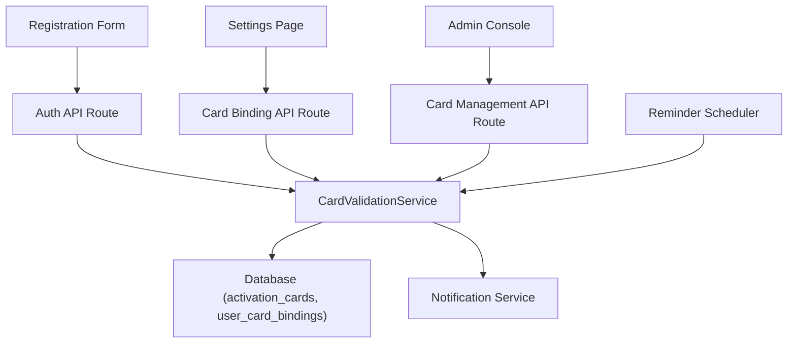

# 卡密功能技术设计

Feature Name: card-license-binding  
Updated: 2026-02-12

## 描述

在现有的 Next.js + React + TypeScript 架构上扩展卡密体系，实现以下能力：

- 注册与登录链路强制校验有效卡密，并将到期时间与账号绑定。
- 通过统一的 `CardValidationService` 管理卡密状态、绑定记录和管理员豁免逻辑。
- 提供设置页的重新绑定 UI 以及 30 天前的提醒机制（复用现有通知总线或邮件服务）。
- 在后台管理控制台提供卡密生命周期的 CRUD 与审计视图。

## 架构

## 组件与接口

- **CardValidationService**：封装卡密查验、有效期计算、绑定写入、管理员豁免判断。暴露 `validate(code, userContext)`、`bind(userId, code)`、`renew(userId, code)`、`disable(codeId)` 等方法，所有 API Route 复用。
- **Auth API Route 扩展**：在注册与登录流程中调用 `CardValidationService`。注册时若校验失败直接返回 4xx；登录时在普通用户分支增加到期校验，管理员角色绕过。
- **Settings Page UI**：新增 `CardStatusCard` 组件显示当前卡密信息、到期倒计时与提醒状态；提供重新绑定表单调用 `/api/card/renew`。
- **Reminder Scheduler**：基于现有 cron/queue（如 `scripts/cron` 或外部 scheduler）定时扫描 30 天内到期的绑定，调用通知服务推送提醒并写入提醒日志，幂等处理重复提醒。
- **Admin Card Console**：在后台（如 `/admin/cards`）提供列表、创建、导出、禁用等操作，支持批量生成指定有效期的卡密并限制可用次数（初期为 1）。
- **Notification Service 适配器**：封装站内信/邮件/推送，提供 `sendCardExpiryReminder(userId, expiresAt)`，与 Reminder Scheduler 解耦。

## 数据模型

- `activation_cards`
  - `id` (uuid)
  - `code` (唯一索引，字符串，采用高复杂度随机值)
  - `duration_type` (enum: `WEEK`, `MONTH`, `QUARTER`, `YEAR`)
  - `expires_at` (计算字段，可基于 `created_at + duration`)
  - `status` (enum: `AVAILABLE`, `BOUND`, `DISABLED`)
  - `max_usage` (默认 1，预留多次使用能力)
  - `created_by` (管理员 id)
  - `metadata` (jsonb，记录备注)

- `user_card_bindings`
  - `id` (uuid)
  - `user_id`
  - `card_id`
  - `bound_at`
  - `expires_at` (复制卡密到期值，便于历史追踪)
  - `reminder_sent_at` (可空，30 天提醒后写入)

- `users`
  - 新增 `role` 枚举或复用现有字段来区分管理员
  - 新增 `active_card_binding_id` 便于快速读取当前绑定

## 正确性约束

- 卡密 `code` 保持全局唯一且在生成时使用事务锁以避免并发重复。
- `bind` 与 `renew` 操作为单事务：扣减卡密可用次数、写入 `user_card_bindings`、更新用户当前绑定。
- 登录检查顺序：先判定管理员角色，再校验卡密到期，确保管理员永远可访问。
- Reminder Scheduler 应保证幂等：同一绑定只在 `reminder_sent_at` 为空时发送提醒。
- 禁用卡密立即失效：一旦 `status` 切换为 `DISABLED`，所有未到期的绑定在下一次登录校验时都视为失效。

## 错误处理

- **校验失败**：向调用方返回 422，并包含具体错误类型（格式错误、已被使用、已过期、被禁用）。
- **绑定冲突**：若用户重复提交同一卡密，返回 409 并保持现有绑定。
- **提醒任务失败**：捕获通知发送异常，记录重试队列并在下一轮 cron 重试，避免遗漏提醒。
- **后台操作**：禁用或删除卡密失败时需回滚事务并给出可读的管理员提示。

## 测试策略

- **单元测试**：覆盖 `CardValidationService` 的状态流转、有效期计算、管理员豁免逻辑。
- **集成测试**：针对注册 API、登录 API、设置页重新绑定 API，使用测试数据库验证事务与错误码。
- **端到端测试**：模拟用户注册、到期提醒触发、重新绑定、管理员管理等完整流程，确保 UI 与 API 协同。
- **回归测试**：管理员登录、普通登录在卡密功能开启后仍保持既有体验。

## 参考资料

[^1]: (README.md) - 项目总体介绍与技术栈
