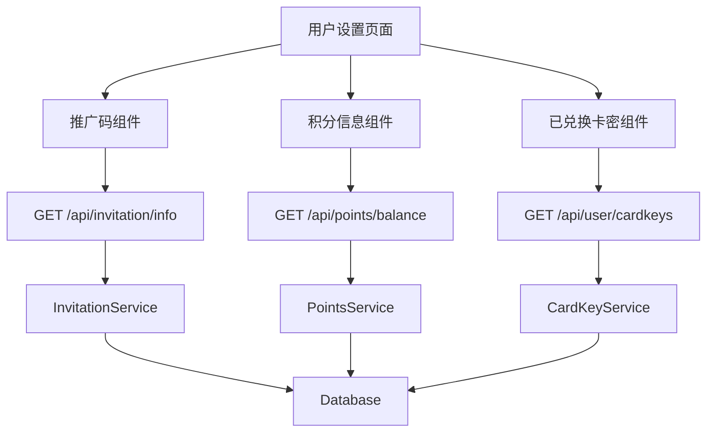

# 推广码积分兑换系统

功能名称: referral-reward-system
更新日期: 2026-02-17

## 描述

为 MoonTV 系统完善推广码和积分兑换功能，包括：用户推广码展示、积分信息展示、已兑换卡密列表查询与展示。

## 架构



## 组件和接口

### 1. 新增 API 接口

#### GET /api/user/cardkeys

获取当前用户已兑换的卡密列表。

**响应:**

```typescript
{
  cardKeys: Array<{
    id: string;
    plainKey: string; // 卡密明文
    type: CardKeyType; // 卡密类型
    status: CardKeyStatus; // 卡密状态
    source: string; // 来源：redeem
    createdAt: number; // 创建时间
    expiresAt: number; // 过期时间
    daysRemaining: number; // 剩余天数
  }>;
}
```

### 2. 前端组件

#### UserReferralInfo 组件

展示用户推广码和积分信息的组件。

**功能:**

- 显示用户专属推广码
- 支持一键复制推广码
- 显示推广链接（带推广码参数）
- 显示当前积分余额
- 显示累计邀请人数
- 显示累计获得积分

#### UserRedeemedCardKeys 组件

展示用户已兑换卡密列表的组件。

**功能:**

- 显示已兑换卡密列表
- 每个卡密显示：卡密明文、类型、状态、过期时间
- 支持复制卡密
- 区分已使用/未使用状态

### 3. 数据模型

使用现有数据模型，无需新增。

## 正确性属性

1. **推广码唯一性**: 每个用户的推广码全局唯一
2. **积分非负**: 用户积分余额不能为负数
3. **卡密状态一致性**: 卡密状态与实际使用情况一致
4. **IP 防刷**: 同一 IP 不能重复获得邀请奖励

## 错误处理

| 错误场景       | 处理策略                             |
| -------------- | ------------------------------------ |
| 积分不足       | 返回错误提示，显示当前余额和所需积分 |
| 卡密生成失败   | 回滚积分扣除，返回错误提示           |
| 推广码复制失败 | 使用备用复制方法（textarea）         |
| 网络请求失败   | 显示错误提示，提供重试按钮           |

## 测试策略

### 单元测试

1. `PointsService.redeemForCardKey()` - 测试积分兑换逻辑
2. `InvitationService.getUserInvitationInfo()` - 测试推广码信息获取

### 集成测试

1. 完整邀请流程：用户A分享推广码 -> 用户B注册 -> 用户A获得积分
2. 积分兑换流程：积分达标 -> 兑换卡密 -> 积分扣除 -> 卡密绑定

### 端到端测试

1. 用户在设置页面查看推广码并复制
2. 用户查看积分余额并兑换卡密
3. 用户查看已兑换卡密列表

## 实现计划

### 阶段 1: API 层实现

1. 新增 `GET /api/user/cardkeys` 接口
2. 在 `db.ts` 中添加 `getUserCardKeysBySource` 方法（按来源筛选）

### 阶段 2: 前端组件实现

1. 创建 `UserReferralInfo` 组件
2. 创建 `UserRedeemedCardKeys` 组件
3. 更新设置页面整合新组件

### 阶段 3: 测试与优化

1. 添加单元测试
2. 端到端功能测试
3. 性能优化（列表分页）

## 文件变更清单

| 操作 | 文件路径                                  | 说明             |
| ---- | ----------------------------------------- | ---------------- |
| 新增 | `src/app/api/user/cardkeys/route.ts`      | 用户卡密列表 API |
| 新增 | `src/components/UserReferralInfo.tsx`     | 推广码信息组件   |
| 新增 | `src/components/UserRedeemedCardKeys.tsx` | 已兑换卡密组件   |
| 修改 | `src/app/settings/page.tsx`               | 整合新组件       |
| 修改 | `src/lib/db.ts`                           | 添加卡密查询方法 |
